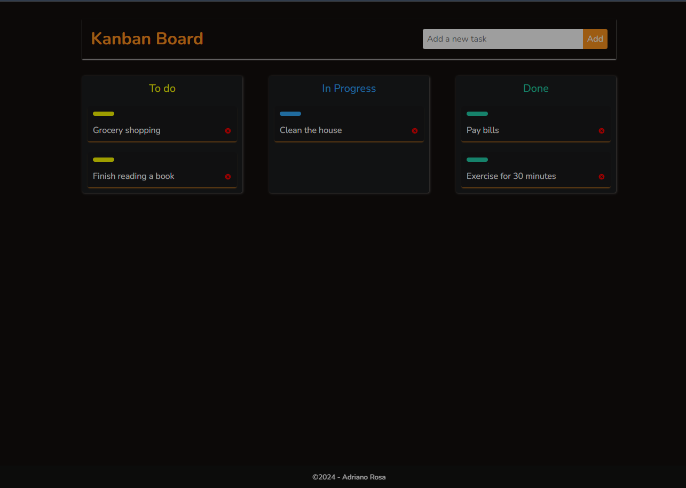
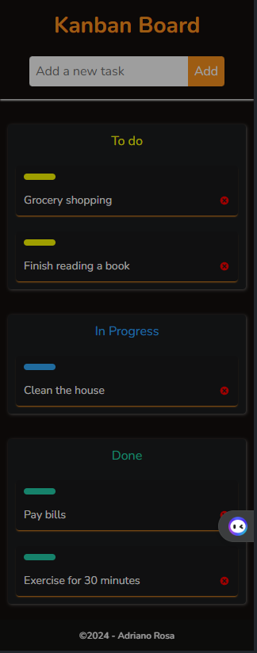

# Kanban Board

## Description

The "Kanban Board" project is an interactive visual tool that allows you to manage and track the progress of tasks. Tasks are represented by cards, which are added to the "To Do" column through an input box. As tasks are started, the cards are moved to the "In Progress" column. When tasks are completed, the cards are then moved to the "Done" column. This flow allows for efficient tracking of task progress and facilitates work organization.

## Technologies

- React
- JavaScript
- CSS

## Libraries

- [react-icons](https://react-icons.github.io/react-icons/)
- [react-dnd](https://react-dnd.github.io/react-dnd/)
- [react-hot-toast](https://react-hot-toast.com/)
- [UUID](https://www.npmjs.com/package/uuid)

## Project Structure

- **App**: main component containing the header, body, and footer.
- **Main**: main component that renders the application.
- **Components**:
  - **Board**: component representing the Kanban board.
  - **BoardList**: component representing the task list in a board column.
  - **Card**: component representing a task.
  - **CreateTask**: component for creating new tasks.
- **Context**: 
  - **TasksContext**: context for task management.
- **CSS**: contains all page styles to ensure responsiveness and the Drag and Drop concept.

## Images

## Notes

- The project is responsive and uses the Drag and Drop concept for managing tasks on the Kanban board.

--- 

Feel free to contribute to the project or get in touch if you have any questions or suggestions! 🚀

